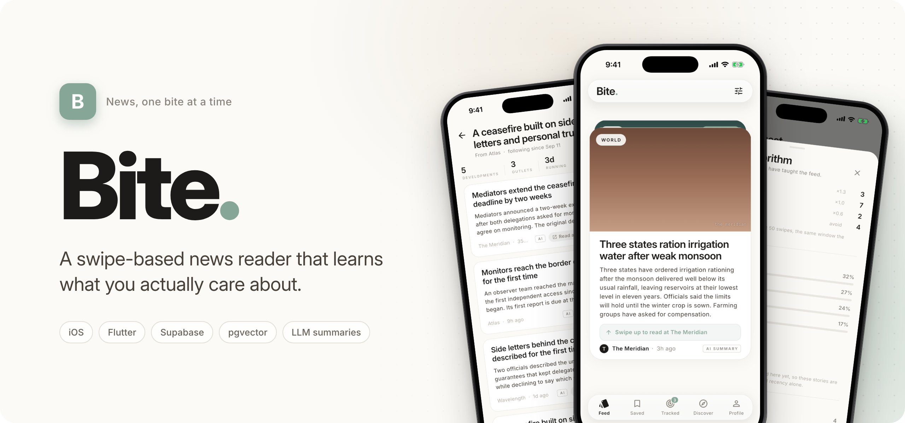
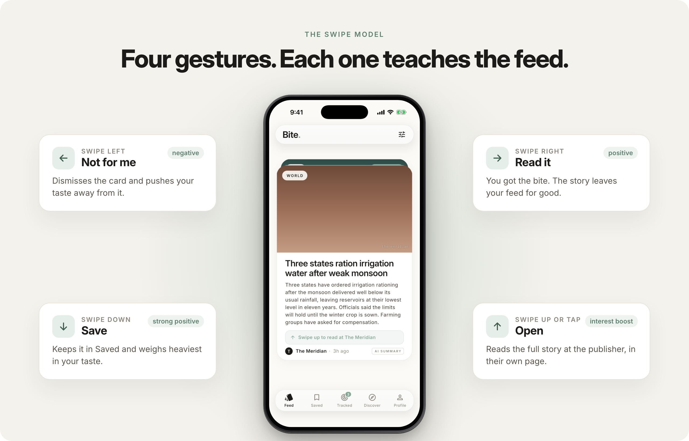
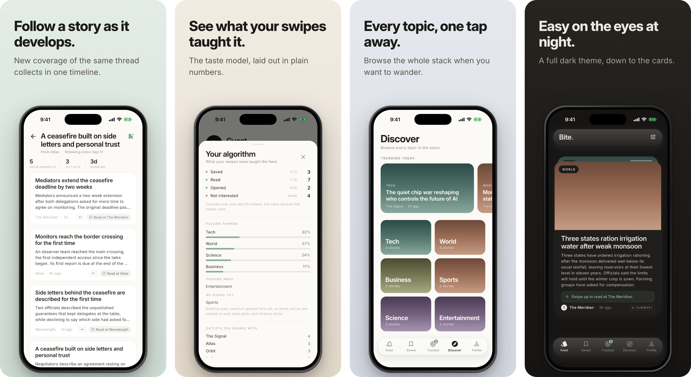

<p align="center">
  
</p>

<div align="center">


[](LICENSE)

**A swipe-based news reader that learns what you actually care about.**<br>
<sub>iOS app · Flutter · Supabase</sub>

[Overview](#overview) · [Highlights](#highlights) · [Screenshots](#screenshots) · [How it works](#how-it-works) · [Getting started](#getting-started) · [Status](#status-and-roadmap)

</div>

<p align="center">
  
</p>

> [!IMPORTANT]
> **Source-available, not open source.** This repository is public as a portfolio work sample. You may read the code, but reuse, modification and redistribution are not permitted. See [LICENSE](LICENSE).

## Overview

Bite turns the news into a deck of cards. Every swipe is a signal: behind the gestures, a recommendation engine builds a model of your taste, an LLM rewrites each story into a short *bite* you read on the card itself, and story trackers follow a developing thread for you over time.

The Flutter client never calls a news API. A Supabase backend (Postgres with pgvector, Deno edge functions and cron pipelines) ingests publisher RSS feeds, embeds and summarises them, and serves one personalised feed.

## Highlights

| Feature | What it does |
|---|---|
| **Four gestures, four meanings** | Left rejects, right reads, down saves, up opens. Each swipe is weighted feedback for the recommender. |
| **A bite, not a headline** | An LLM condenses each story to a hook and a 50 to 80 word summary. The cap is enforced in code, not only in the prompt. |
| **Taste model on pgvector** | A weighted centroid of what you read and save, with a topic penalty and one exploratory card in six. |
| **Story trackers** | Follow a developing story and new coverage of the same thread collects in its own timeline. |
| **A referrer, not a replacement** | Every card links out to the publisher. robots.txt is honoured and click-through is measured per publisher. |
| **Keyless, offline-first client** | No API keys in the app bundle. Swipes and saves queue locally and sync when the network returns. |

## Screenshots

<p align="center">
  
</p>

## How it works

Scheduled edge functions keep one Postgres table of articles fresh. The app reads a single personalised RPC.

```text
 Publisher RSS feeds ── robots.txt honoured, one honest User-Agent
     │
     ▼
 ingest-rss ─────────── every 6 h · dedupe · fair share per outlet
     │
     ▼
 Postgres + pgvector ◀── embed ────────────── gte-small vectors
     │               ◀── summarize-articles ── LLM bite, capped at 80 words
     │               ◀── match-trackers ────── cosine match to followed stories
     ▼
 get_personalized_feed() ── taste + category + recency − topic penalty
     │                     + region boost · 1 card in 6 exploratory
     ▼
 Flutter app ── swipe left / right / down / up ── signals flow back
```

- **Row-level security on every table.** Each user sees only their own saves, swipes and trackers.
- **The feed gates on the bite.** A story without a summary waits for the next run instead of showing up bare.
- **Always launchable.** With no credentials the app runs on bundled mock data.

<details>
<summary><strong>The recommender in detail</strong></summary>

| Gesture | Meaning | Signal |
|---|---|---|
| **← Left** | Reject | Negative signal · dismisses the card (resettable) |
| **→ Right** | Read | Positive signal · permanently excluded from feed |
| **↓ Down** | Save | Strong positive · added to your Saved list |
| **↑ Up / Tap** | Open | Additive interest boost · opens the publisher's page (non-terminal) |

- **Weighted taste centroid**: your taste is the weighted average of the embeddings of stories you read and saved, pushed away from what you reject.
- **Cold-start onboarding**: before the model has enough signal, the feed is a category-diverse interleave seeded by the topics and region you pick during onboarding.
- **Topic anti-domination**: a penalty stops any single hot category from flooding the deck.
- **Exploration slice**: roughly one card in six is an intentional off-taste pick, so the feed keeps discovering instead of collapsing into a filter bubble.
- **Region is a boost, never a filter**: a mild additive lift (`REGION_BOOST = 0.12` against a similarity weight of `0.55`) for in-region stories. Out-of-region stories are never penalised.

</details>

<details>
<summary><strong>Publisher-direct sources: a referrer, not a replacement</strong></summary>

Bite reads a small, version-controlled registry of publisher RSS feeds. The design makes "referrer, not replacement" structural:

- **Attribution can't be dropped.** Publisher name and canonical URL are required columns; a card cannot render without them.
- **Every story is link-out only.** There is no native reader: every card opens the publisher's own page, with their layout, branding and advertising.
- **The bite informs, it doesn't complete.** Summaries are capped at 80 words in code.
- **Nothing is circumvented.** One fixed User-Agent (`BiteNewsBot/1.0`), `robots.txt` parsed and honoured per domain including `Crawl-delay`, and any paywall, consent wall or bot challenge aborts the fetch. See the [bot policy](https://waterduckpani.github.io/Bite/bot/).
- **It's measured.** `referral_events` records impressions and link-outs, so per-publisher click-through is a number, not a claim.

No publisher is added on assumption: `tools/qualify_publisher.dart` checks each candidate's feed, robots.txt, content depth, categories and volume, and its report is committed under [`docs/publishers/`](docs/publishers/).

</details>

<details>
<summary><strong>Architecture</strong></summary>

```text
Flutter (iOS-first)
├─ State           AppState: single source of truth, InheritedWidget scope
├─ Persistence     UserDataRepository: offline op-queue, optimistic writes,
│                  hydrate-on-startup, anonymous → email/Apple auth upgrade
├─ Feed            personalised RPC → mock fallback (always launchable keyless)
└─ Reader          in-app browser only; every story opens at the publisher

Supabase
├─ Postgres        articles, profiles, saves, swipe_events, category_prefs,
│                  story_trackers, tracker_articles, publishers,
│                  referral_events  (+ pgvector, RLS everywhere)
├─ Edge Functions  ingest-rss · embed · summarize-articles · match-trackers
└─ Scheduling      pg_cron pipelines: ingest → embed/summarise → match → purge
```

</details>

## Tech stack

| Layer | Tools |
|---|---|
| **Client** |    |
| **Backend** |      |
| **AI** |    |

## Getting started

**Requirements**

- Flutter SDK (Dart 3.5+)
- Xcode with the iOS Simulator
- Optional: a Supabase project for live data

### 1. Run on mock data

```bash
flutter pub get
flutter run
```

No credentials needed. The feed runs on bundled mock data.

### 2. Connect Supabase (optional)

```bash
cp .env.example .env
```

Add the Supabase URL and anon key. News-API keys never belong in the client; edge functions and the cron schedule deploy separately with the Supabase CLI.

Running the backend (the publisher registry, click-through reports and AI spend) is covered in the [developer handbook](docs/DEVELOPER.md).

<details>
<summary><strong>Project structure</strong></summary>

```text
lib/
├─ config/     AppConfig and feed tuning constants
├─ data/       bundled mock articles, palettes, source metadata
├─ models/     Article, StoryTracker, Region
├─ screens/    feed · browser · saved · tracked · discover · onboarding · profile
├─ services/   UserDataRepository (persistence and auth)
├─ state/      AppState
├─ theme/      design system: colour, type, motion
└─ widgets/    article card, tab bar, gesture tutorial, glass, cover art

supabase/functions/   ingest-rss · embed · summarize-articles · match-trackers
tools/                qualify_publisher.dart (publisher vetting)
docs/                 developer handbook · publisher reports · bot policy · privacy · terms
test/                 widget and flow tests
```

Database migrations contain no secret values: where one is required, the file carries a `__PLACEHOLDER__` token and the real value comes from a gitignored `supabase/*.local.sql`.

</details>

## Status and roadmap

Works end to end on iOS. Not yet on the App Store; the remaining steps are listed in [the submission checklist](docs/appstore/submission-checklist.md).

- [x] pgvector recommendation engine
- [x] Server-side RSS ingestion and AI bites
- [x] Four-gesture swipe
- [x] Story trackers
- [x] Publisher click-through reporting
- [x] Account deletion, privacy policy and privacy manifest
- [ ] App Store submission

## License

Proprietary, source-available, view-only. Copyright © 2026 Bharat Khanna. This code is published to be read as a work sample; it may not be reused, modified or redistributed. See [LICENSE](LICENSE).

[Privacy policy](https://waterduckpani.github.io/Bite/privacy/) · [Terms of use](https://waterduckpani.github.io/Bite/terms/) · [BiteNewsBot](https://waterduckpani.github.io/Bite/bot/)

---

<div align="center">
  <sub>Built by <a href="https://github.com/waterduckpani">Bharat Khanna</a> · <a href="https://github.com/waterduckpani?tab=repositories">More projects</a></sub>
</div>
